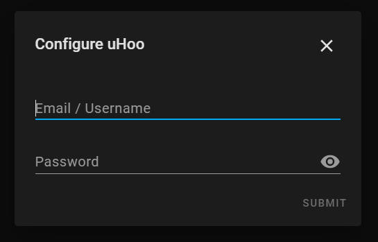

# uHoo for Home Assistant

[![HACS Custom Repository][hacs-shield]][hacs]
[![GitHub Release][releases-shield]][releases]
![Project Maintenance][maintenance-shield]
[![License][license-shield]](LICENSE.md)

[![pre-commit.ci][pre-commit-ci-shield]][pre-commit-ci]
[![Build Status][build-shield]][build]

## About

Integrates support for the [uHoo](https://getuhoo.com/) air quality monitor into Home Assistant.

This integration has been tested with the uHoo home device. It might work with the business uHoo Aura device but that is untested.


## Installation

### HACS

Add `https://github.com/csacca/uhoo-homeassistant` as a custom integration repository and install the uHoo integration.

### Manual

Clone or download this repository, and copy the `custom_components/uhoo` directory into the `config/custom_components` directory of your Home Assistant instance. Restart Home Assistant.

## Configuration

Once installed, the uHoo integration is configured via the Home Assistant UI:

**Configuration** -> **Integrations** -> **Add** -> **uHoo (HACS)**

When prompted, enter your uHoo username (email address) and password.



## Setting up development environment

This project is fully manage using the [Poetry][poetry] dependency manager.

You need at least:

- Python 3.8+
- [Poetry][poetry-install]

To install all packages, including development dependencies:

```bash
poetry install
```

This repository uses the [pre-commit][pre-commit] framework and all changes are formatted and linted prior to each commit. To run the checks manually:

```bash
poetry run pre-commit run --all-files
```

To run all project tests:

```bash
poetry run pytest
```

[build-shield]: https://github.com/csacca/uhoo-homeassistant/actions/workflows/ci.yaml/badge.svg
[build]: https://github.com/csacca/uhoo-homeassistant/actions/workflows/ci.yaml
[hacs-shield]: https://img.shields.io/badge/HACS-Custom-orange.svg
[hacs]: https://hacs.xyz/
[license-shield]: https://img.shields.io/github/license/csacca/uhoo-homeassistant.svg
[maintenance-shield]: https://img.shields.io/maintenance/yes/2021.svg
[pre-commit-ci-shield]: https://results.pre-commit.ci/badge/github/csacca/uhoo-homeassistant/master.svg
[pre-commit-ci]: https://results.pre-commit.ci/latest/github/csacca/uhoo-homeassistant/master
[poetry-install]: https://python-poetry.org/docs/#installation
[poetry]: https://python-poetry.org
[pre-commit]: https://pre-commit.com/
[releases-shield]: https://img.shields.io/github/release/csacca/uhoo-homeassistant.svg
[releases]: https://github.com/csacca/uhoo-homeassistant/releases
